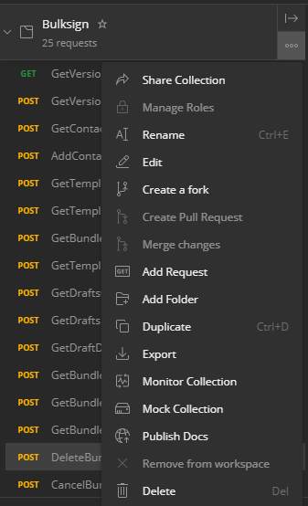
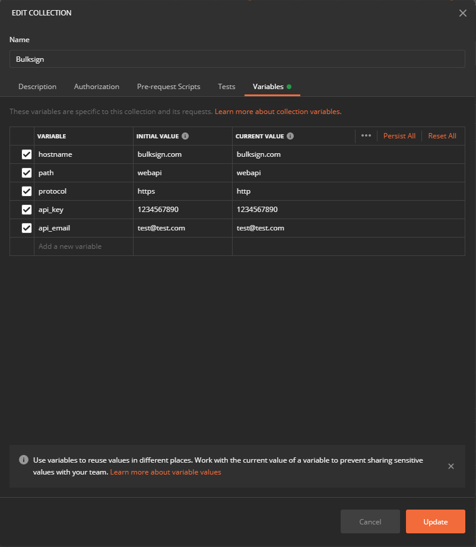

# Postman Rest Api Collection

### How to use this ?

* clone this repository

* install <a href="https://www.postman.com/">Postman</a> (or any other REST tool that allows you to import collections) and run it

* File\Import\Upload Files and choose the "collection.json" obtained from this repository. Confirm the import.

* The collection should now be imported successfully in Postman, and you should see all the requests under "Bulksign". Click the "..." button and choose "Edit".

* Select "Variables" tab, this collection contains variables to allow you to easily customize which Bulksign instance you target with your requests.

Modify the variables according to the Bulksign instance for which you want to do the requests : 

**hostname** : set the hostname of the Bulksign instance (bulksign.com is the default for targeting the SAAS instance)

**path** : the path of the Bulksign WebApi  (default is webapi)

**protocol** : choose between http and https

**api_key** : set the Bulksign API key 

**api_email** : set the email address of the Bulksign user (if you want to authenticate with a personal or global token leave the value for this field empty)

* Run the requests

